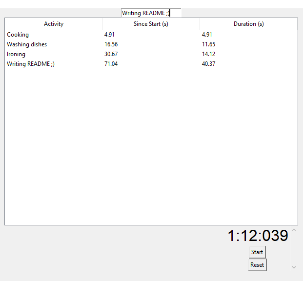

# SimpleStopwatch is a simple application which allows to track time of many activities.

## How to use it

1. Press the Start Button
2. Type the name of the activity
3. Press Enter
4. Go to step 2 as many times you want
5. Press the stop Button

## Installation
1. 